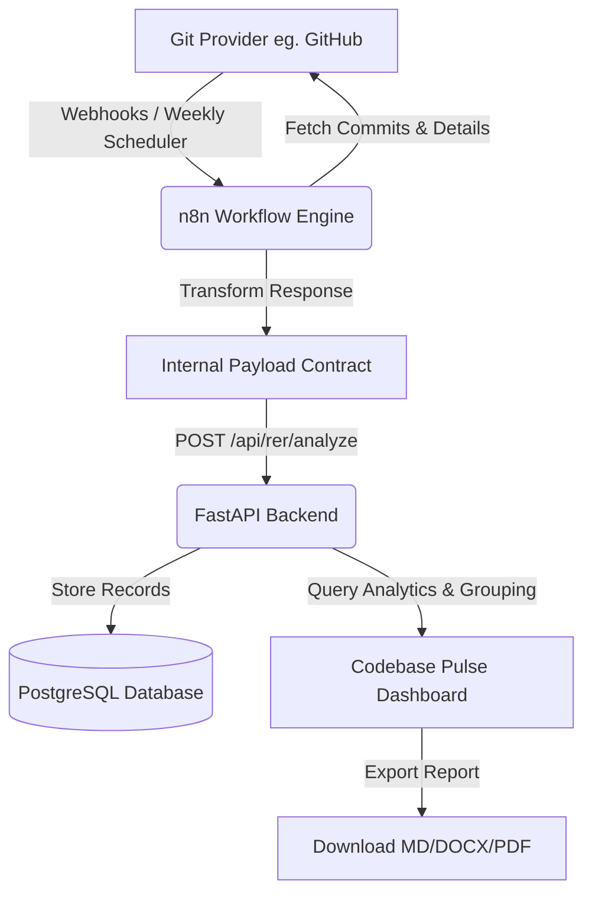

# Codebase Pulse Architecture Specification

Codebase Pulse is a dedicated, decoupled repository analytics module in DevOracle designed to track and represent repository evolution over time. It abstracts version control payloads to remain platform-agnostic, supporting GitHub, GitLab, and Bitbucket out-of-the-box.

---

## 1. System Architecture & Workflow

The system is automated using **n8n** in the background, which queries raw git provider metadata, filters and maps it to the DevOracle internal representation, and feeds it into the FastAPI endpoint.



---

## 2. API Schema Contract

To prevent breaking backend APIs upon introducing new git providers, the payload format from n8n is strictly normalized to the following:

```json
{
  "commits": [
    {
      "repository": "owner/repository-name",
      "branch": "main",
      "commit_sha": "a1b2c3d4e5f6g7h8i9j0",
      "author": "developer_username",
      "commit_message": "feat: user profile endpoints implemented",
      "commit_date": "2026-06-25T12:00:00Z",
      "files": [
        "backend/app/api/auth.py",
        "backend/app/models/user.py"
      ],
      "patch": "diff --git a/backend/app/api/auth.py...",
      "additions": 45,
      "deletions": 12,
      "total_changes": 57
    }
  ]
}
```

---

## 3. Database Schema

Stored in `commit_records` PostgreSQL table:

| Column Name | Data Type | Constraints / Attributes |
| :--- | :--- | :--- |
| `id` | `UUID` | Primary Key, Default: `uuid_generate_v4()` |
| `user_id` | `UUID` | Foreign Key (`users.id`, `ondelete="CASCADE"`) |
| `repository` | `VARCHAR` | Indexed, Not Null |
| `branch` | `VARCHAR` | Default: `"main"`, Not Null |
| `commit_sha` | `VARCHAR` | Indexed, Not Null |
| `author` | `VARCHAR` | Indexed, Not Null |
| `commit_message` | `TEXT` | Not Null |
| `commit_date` | `TIMESTAMP WITH TIME ZONE` | Indexed, Not Null |
| `files` | `JSONB` | List of changed file names |
| `patch` | `TEXT` | Optional raw diff content |
| `additions` | `INTEGER` | Default: `0`, Not Null |
| `deletions` | `INTEGER` | Default: `0`, Not Null |
| `total_changes` | `INTEGER` | Default: `0`, Not Null |
| `created_at` | `TIMESTAMP WITH TIME ZONE` | Default: `NOW()` |

---

## 4. REST API Routing Table

Registered under `/api/rer` prefix:

- **`POST /api/rer/analyze`**
  - Accepts: `CommitBatchRequest`
  - Purpose: Batch inserts processed commits. Deduplicates on commit SHA and repository.
- **`GET /api/rer/report`**
  - Accepts Query Parameters: `repository`, `branch`, `week` (Optional, ISO Format `YYYY-Www`)
  - Purpose: Returns the computed Repository Evolution Report (RER) stats.
- **`GET /api/rer/history`**
  - Purpose: Lists all repositories and branches scanned in past reports for history navigation.
- **`GET /api/rer/download`**
  - Accepts Query Parameters: `repository`, `branch`, `week`, `format` (`markdown`, `pdf`, `docx`)
  - Purpose: Streaming Response of formatted report text.

---

## 5. Dashboard Layout Design

The dashboard is structured into four premium, high-interaction sections:

1. **RER Executive Summary**: At-a-glance cards showing Total Commits, Files Changed, Contributors, and Branch details. Includes ranked lists of High-Activity Directories (using top-level file paths) and Repeatedly Modified Files.
2. **Daily Timeline**: Interactively groups commits by day of the week (Monday - Sunday). Clicking a day displays a clean list of commits made on that day.
3. **Commit Explorer**: Real-time client-side filter searching across commit messages, authors, and SHAs instantly.
4. **Meeting Mode**: Full-screen presentation overlay with sequential navigation keys (`Previous` and `Next`) to review commits one-by-one during engineering standups.
